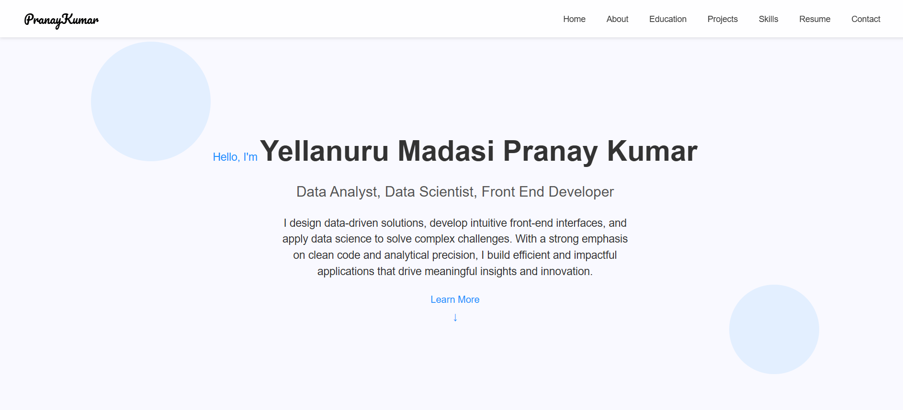

# Pranay Kumar's Portfolio

Welcome to my portfolio! This website showcases my skills, projects, and experience as a **Data Analyst** and **Front-End Developer**. Explore my work in data analysis, web development, and more.

🌐 **Live Site**: [portfolio.pranaykumar.me](https://pranaykumar30.github.io/Pranay_portfolio)

## 📖 About This Project

This portfolio is a static website built to highlight my professional journey, including my education, projects, technical skills, and contact information. It’s designed to be responsive, user-friendly, and visually appealing, with a focus on showcasing my expertise in data analysis and front-end development.

## ✨ Features

- **Responsive Design**: Works seamlessly on desktop, tablet, and mobile devices.
- **Dynamic Sections**: Home, About, Education, Projects, Skills, Resume, and Contact.
- **Interactive Projects**: Expandable project cards with detailed descriptions, tech stack, and live demo links.
- **Contact Form**: Integrated with Formspree for easy communication.
- **Favicon**: Custom favicon for a professional look in browser tabs.

## 🛠️ Technologies Used

- **HTML5**: For the structure of the website.
- **CSS3**: For styling and responsive design, including media queries.
- **JavaScript**: For dynamic loading of sections and interactive features (e.g., project expansion).
- **GitHub Pages**: For hosting the live site.
- **Formspree**: For handling contact form submissions.
- **Google Fonts**: For the Pacifico font used in the design.

## 🚀 Getting Started

If you’d like to run this portfolio locally or contribute to it, follow these steps:

### Prerequisites
- A modern web browser (e.g., Chrome, Firefox).
- Git installed on your machine (optional, for cloning the repository).
- A local server (e.g., VS Code Live Server, Python’s `http.server`, or Node.js `http-server`) to test the site locally.

### Installation
1. **Clone the Repository**:
   ```bash
   git clone https://github.com/pranaykumar30/portfolio.git
   cd portfolio
   ```
2. **Run a Local Server**:
   - Using VS Code Live Server: Open the project in VS Code, right-click `index.html`, and select "Open with Live Server."
   - Using Python: Run `python -m http.server 8000` and open `http://localhost:8000` in your browser.
   - Using Node.js: Install `http-server` (`npm install -g http-server`), then run `http-server` and open the provided URL (e.g., `http://localhost:8080`).

3. **Explore the Site**:
   Open the site in your browser to view the portfolio locally.

## 📂 Project Structure

```
portfolio/
├── assets/              # Images, icons, and other static assets
│   ├── icons/          # Social media and tech stack icons
│   ├── images/  # Image for social media sharing
│   └── [other assets]
├── pages/              # HTML files for each section
│   ├── about.html
│   ├── education.html
│   ├── projects.html
│   ├── skills.html
│   ├── resume.html
│   ├── contact.html
├── index.html          # Main HTML file
├── styles.css          # CSS styles for the entire site
├── script.js           # JavaScript for dynamic functionality
└── README.md           # This file
```

## 📬 Contact

Feel free to reach out to me through the Contact section of my portfolio, or connect with me on:

- **LinkedIn**: [linkedin.com/in/yellanurumadasipranaykumar](https://www.linkedin.com/in/yellanurumadasipranaykumar)
- **GitHub**: [github.com/Pranaykumar30](https://github.com/Pranaykumar30)
- **Email**: `pranaykuamryellanurumadasi@gmail.com`


## ⭐ Support

If you find this portfolio inspiring, star this repository on GitHub!

## 📸 Screenshot


